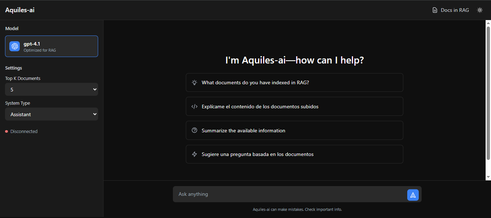
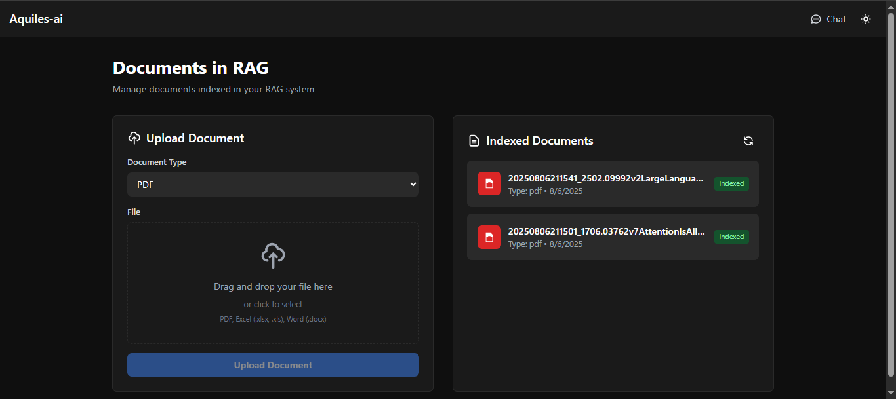

# Aquiles-ai: Demo Chatbot

A demo chatbot that uses **[Aquiles-RAG](https://github.com/Aquiles-ai/Aquiles-RAG)** as a Retrieval-Augmented Generation (RAG) server to index documents and answer queries by combining semantic search with GPT-4.1.

## 📂 Project Structure

```

AI-Server/
├── context.py         # RAG logic: query optimization, indexing, and response streaming
├── main.py            # FastAPI server: HTTP routes and WebSocket endpoint
├── utils.py           # libSQL/Turso client and database helpers
├── templates/         # Jinja2 HTML templates
│   ├── home.html      # Chat interface
│   └── upload.html    # Document upload form
├── static/            # Static assets (JS, CSS, images)
├── .env               # Environment variables
└── README.md          # This document

```

## 🚀 Key Technologies

- **Python 3.9+**  
- **FastAPI** — API routing and async orchestration.  
- **Aquiles-RAG** — Async client for vector indexing and semantic search.  
- **OpenAI API** — `text-embedding-3-small` for embeddings; `gpt-4.1` for answer generation.  
- **libSQL / Turso.tech** — Cloud-hosted SQLite for persisting metadata.  
- **Jinja2** — Dynamic HTML templating.  
- **Platformdirs** — Locates a user data directory for storing uploads.  
- **python-dotenv** — Loads `.env` variables.

## ⚙️ Environment Variables

Create a `.env` file at the project root with:

```dotenv
# OpenAI
OPENAI_API_KEY=your_openai_api_key

# Aquiles-RAG
URL_RAG=http://localhost:8001     # Your Aquiles-RAG server URL
API_KEY_RAG=your_rag_api_key       # Your Aquiles-RAG API key
INDEX_RAG=docs                     # RAG index name

# Turso / libSQL
URL=your_turso_or_sqlite_url
TOKEN=your_turso_auth_token
```

## 📥 Installation & Running

1. **Clone the repo**

   ```bash
   git clone https://github.com/Aquiles-ai/aquiles-chat-demo.git
   cd aquiles-chat-demo
   ```

2. **Install dependencies**

   ```bash
   pip install -r requirements.txt
   ```

3. **Initialize the database**

   ```bash
   python utils.py   # Creates the `docs` table if it doesn’t exist
   ```

4. **Start the server**

   ```bash
   uvicorn main:app --reload --host 0.0.0.0 --port 5600
   ```

5. **Access the UI**

   * Chat interface → `http://localhost:5600/home`
   * Upload page    → `http://localhost:5600/upload`

## 📸 Screenshots

Project UI in action:

<table>
  <tr>
    <td align="center">
      <br/>
      <em>Chat interface</em>
    </td>
    <td align="center">
      <br/>
      <em>Upload form</em>
    </td>
  </tr>
</table>


## 🔍 API Endpoints & WebSocket

### 1. POST `/add-rag`

Upload a document and index it in Aquiles-RAG.

* **Form Data**

  * `file` (UploadFile): `.pdf`, `.xlsx`, `.xls`, or `.docx`
  * `type_doc` (str): `"pdf"`, `"excel"`, or `"word"`

* **Success Response**

  ```json
  { "state": "success" }
  ```

* **Error Response**

  ```json
  { "error": "detailed error message" }
  ```

### 2. GET `/getdocs`

Retrieve a list of all indexed documents.

* **Response**

  ```json
  {
    "docs": [
      {
        "id": 1,
        "path": "/.../20250806123456_doc.pdf",
        "doc_type": "pdf",
        "created_at": "2025-08-06T12:34:56"
      },
      …
    ]
  }
  ```

### 3. WebSocket `/chat`

Real-time streaming for RAG + GPT-4.1 responses.

1. Client sends JSON:

   ```json
   {
     "query": "What is RAG?",
     "top_k": 5
   }
   ```
2. Server streams back text chunks as they are generated.
3. Connection closes when answer is complete.

### 4. HTML Routes

* **GET `/home`** → Chat UI
* **GET `/upload`** → Document upload form

## 🛠️ Internal Workflow

1. **Indexing** (`RAGIndexer` in `context.py`):

   * Extract text from PDF/Excel/Word.
   * Generate embeddings.
   * Send chunks to Aquiles-RAG.
   * Store metadata in Turso’s `docs` table.

2. **Query & Response** (`RAGPipeline` in `context.py`):

   * Optimize the original query into 3–5 concise variants.
   * Fetch `top_k` chunks per variant from Aquiles-RAG.
   * Merge and sort the highest-scoring chunks.
   * Send context + user query to GPT-4.1 with streaming.

3. **Database** (`utils.py`):

   * Manage connections and CRUD operations on Turso (SQLite cloud).


## 🤖 Usage Example

1. **Upload** a PDF containing your project documentation.
2. **Ask** in the chat: “How do I configure FastAPI?”
3. **Receive** a step-by-step answer, grounded in your PDF content.


## 📈 Future Improvements

* **Deployment**: Docker, Vercel, PythonAnywhere.
* **Authentication**: JWT, OAuth.
* **Monitoring Dashboard**: Usage metrics & index health.
* **Additional Formats**: Support TXT, Markdown, HTML.
* **User Interface**: Allow browsing/upload history and credits.
